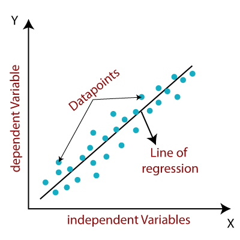
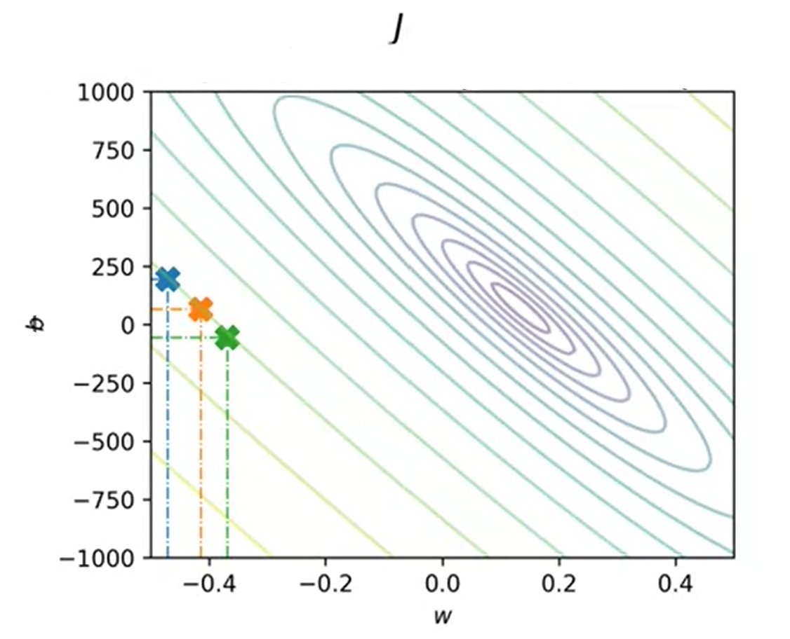

# 선형 회귀 (Linear Regression)

회귀(regression)는 **숫자 값을 예측**하는 데 쓰이는 가장 흔한 알고리즘 집합임.  
회귀 모델은 가능한 값이 무한히 많은 **연속형 출력**을 예측함.

-   **선형 회귀**: 데이터에 **직선**을 맞춰서 예측함.
-   **비선형 회귀**: 데이터에 **곡선**을 맞춰서 예측함.
-   **단변량(uni­variate) 선형 회귀**: 입력 변수가 **하나**일 때의 선형 회귀.  
    (실전에서는 방 개수, 위치, 연식 등 **여러 입력 변수**를 동시에 쓰는 다변량 모델도 흔함.)

예: **주택 가격 예측**  
주택의 **면적(제곱피트)** 을 입력으로 받아, 그에 따른 **가격**을 예측하는 문제는 전형적인 선형 회귀 예시임.



---

# 모델의 정의 (Defining the Model)

선형 회귀 모델은 다음 함수로 표현됨:

$$
f_{w,b}(x) = wx + b
$$

여기서

-   $w$ : 직선의 **기울기**(slope) — $x$ 가 1만큼 늘 때 $y$ 가 얼마나 변하는지
-   $b$ : **절편**(y-intercept) — $x = 0$ 일 때의 예측값

학습이 끝나 직선이 데이터에 **적합(fit)** 되면, 같은 형태의 함수로 **새 입력**에 대해 값을 예측함.  
다만 이제 출력은 “정답”이 아니라 **모델이 추정한 값(예측값)** 이 됨.

예측식은 다음과 같음:

$$
\hat{y} = f_{w,b}(x^i) = wx^i + b
$$

-   $x^i$ : $i$ 번째 입력(예: $i$ 번째 집의 면적)
-   $\hat{y}$ : 그 입력에 대한 **예측 가격**

요약: 데이터를 가장 잘 설명하는 직선 $wx + b$ 를 찾고,  
그 직선을 이용해 **새로운 $x$** 에 대한 $\hat{y}$ 를 계산하는 것이 선형 회귀의 핵심임.

# 비용 함수 (The Cost Function)

## 비용 함수의 개념 (Finding the Cost Function)

선형 회귀에서 **기울기($w$)** 와 **절편($b$)** 은 회귀선의 **기울기 방향과 위치**를 결정하는 핵심 요소다.  
따라서 이 두 파라미터가 데이터에 **얼마나 잘 맞는지**를 정량적으로 평가하는 것이 매우 중요하다.  
이렇게 모델의 “적합도(fit)”를 수치화하는 과정을 **비용 함수(cost function)** 를 찾는 과정이라고 한다.

---

예측값 $\hat{y}^i$ 와 실제값 $y^i$ 사이의 차이를 **오차(error)** 라고 하며,  
이 두 값의 차이를 제곱한 형태로 표현하면 다음과 같다.

$$
\sum_{i=1}^m (\hat{y}^i - y^i)^2
$$

-   $i$: 개별 학습 데이터의 인덱스
-   $m$: 전체 학습 데이터의 개수
-   $(\hat{y}^i - y^i)^2$: 예측값과 실제값의 차이를 제곱한 오차 (제곱 오차)

이 식은 **모든 학습 데이터의 제곱 오차를 더한 값**으로,  
모델이 전체 데이터에 얼마나 잘 맞는지를 보여준다.

---

### 평균 제곱 오차 (Mean Squared Error)

데이터가 많아질수록 단순히 오차의 합을 계산하기보다  
**평균 제곱 오차(Mean Squared Error, MSE)** 를 사용하는 것이 효율적이다.

이를 수식으로 정의하면 다음과 같다.

$$
J(w,b) = \frac{1}{2m} \sum_{i=1}^m (\hat{y}^i - y^i)^2
$$

여기서

-   $J(w,b)$: 비용 함수 (Cost Function)
-   $w, b$: 학습해야 할 파라미터 (기울기와 절편)
-   $\frac{1}{2m}$: 평균을 내기 위한 정규화 항(단, 2는 수학적 편의상 추가됨)

> 참고: $2m$으로 나누는 이유는 미분 시 계산을 단순화하기 위해서이며,  
> 결과적으로 학습 과정의 안정성을 높여준다.  
> $m$만 사용해도 수학적으로는 동일한 의미를 가진다.

---

### 함수 형태로의 일반화

앞서 사용한 $\hat{y}^i$ 대신,  
이를 **함수 형태의 모델 표현**으로 대체하면 다음과 같다.

$$
J(w,b) = \frac{1}{2m} \sum_{i=1}^m (f_{w,b}(x^i) - y^i)^2
$$

이 식에서

-   $f_{w,b}(x^i)$: 입력 $x^i$에 대한 모델의 예측값 (함수 형태)
-   $y^i$: 실제 관측값 (정답)
-   $w, b$: 모델이 학습을 통해 조정해야 할 매개변수(parameter)

즉, **비용 함수 $J(w,b)$** 는  
모델이 모든 데이터에 대해 얼마나 잘 예측하고 있는지를 수치로 평가하며,  
이 값이 작을수록 모델이 데이터에 더 잘 맞는다는 뜻이다.

---

### 핵심 요약

-   비용 함수는 모델의 **예측 오차를 정량적으로 평가**하기 위한 척도이다.
-   **제곱 오차(Squared Error)** 를 사용하여 큰 오차에 더 큰 패널티를 부여한다.
-   $\frac{1}{2m}$ 을 곱해 평균화함으로써,  
    데이터 개수에 관계없이 일관된 학습이 가능하다.
-   모델은 학습을 통해 **비용 함수 $J(w,b)$를 최소화하는 방향**으로  
    $w$와 $b$를 점진적으로 조정하게 된다.

## 비용 함수의 최적화 (Optimizing the Cost Function)

선형 회귀의 핵심 목표는 **비용 함수 $J(w,b)$ 를 가능한 한 작게(minimize)** 만드는 것이다.  
즉, 모델의 예측이 실제 데이터와 최대한 가깝게 되도록  
매개변수 $w$ (기울기)와 $b$ (절편)을 조정하는 과정이다.

이를 수식으로 표현하면 다음과 같다.

$$
\underset{w,b}{\text{minimize}} \; J(w,b)
$$

즉,

> “$w$와 $b$를 조정하여 비용 함수 $J(w,b)$의 값을 최소화하는 조합을 찾아라.”

---

### 비용 함수의 시각화

비용 함수 $J(w,b)$는 두 개의 변수($w$, $b$)를 포함하므로,  
이를 **2차원 평면**이나 **3차원 공간**으로 시각화할 수 있다.

-   **2D 그래프 (Contour Plot)** :  
    동일한 비용값을 가지는 점들을 등고선처럼 연결한 그래프  
    → 비용이 낮을수록 중앙으로 모임

-   **3D 그래프 (Surface Plot)** :  
    $w$와 $b$의 변화에 따라 비용이 어떻게 변하는지를 입체적으로 표현  
    → 최솟값은 “그릇의 바닥”처럼 보이는 지점


_비용 함수의 3D 표면 그래프 — $w$와 $b$에 따른 변화_



_비용 함수의 2D 등고선 그래프 — $w$와 $b$의 최적 조합은 중앙 지점에서 결정됨_

---

# 다중 특성 선형 회귀 (Multiple Feature Linear Regression)

지금까지는 입력값이 하나인 **단일 특성(single feature)** 선형 회귀를 다루었다.  
하지만 실제 문제에서는 하나의 변수로 결과를 정확히 예측하기 어렵다.

예를 들어, 집값을 예측할 때는 **면적**만으로는 충분하지 않다.  
다음과 같은 여러 요인이 함께 작용한다.

-   방의 개수 (number of bedrooms)
-   욕실의 개수 (number of bathrooms)
-   위치(location)
-   건축 연도(year built) 등

이처럼 여러 입력 변수를 함께 고려하는 모델을 **다중 선형 회귀 (Multiple Linear Regression)** 라고 한다.

---

## 수식 표기법 (Notation)

입력 특성이 여러 개인 경우, 표기법을 약간 수정해야 한다.

| 기호        | 의미                                                                    |
| ----------- | ----------------------------------------------------------------------- |
| $x_j$       | $j$번째 특성 (feature)                                                  |
| $n$         | 전체 특성의 개수                                                        |
| $\vec{x}^i$ | $i$번째 학습 데이터의 모든 특성 벡터 (예: $[x_1^i, x_2^i, ..., x_n^i]$) |
| ${x_j}^i$   | $i$번째 학습 데이터에서 $j$번째 특성의 값                               |

---

예를 들어, 집값 예측 문제에서  
한 데이터($i$번째 집)의 입력 벡터는 다음과 같이 표현할 수 있다.

$$
\vec{x}^i = [ \text{면적}, \text{방 개수}, \text{욕실 개수}, \text{위치}, \ldots ]
$$

즉, 단일 변수 $x$ 대신  
벡터 형태의 입력 $\vec{x}$ 를 사용함으로써  
여러 요인이 결과값에 동시에 영향을 주도록 모델을 확장한 것이다.

---

### 핵심 요약

-   비용 함수 $J(w,b)$ 는 모델의 예측 정확도를 평가하는 기준임.
-   $w$, $b$ 를 조정하여 $J(w,b)$ 가 **가장 작아지는 지점**을 찾는 것이 목표임.
-   2D/3D 그래프를 통해 비용 함수의 **모양(볼록한 형태)** 과 **최솟값 위치**를 시각화할 수 있음.
-   입력 변수가 여러 개인 경우, 선형 회귀는 **벡터 형태**로 확장되어  
    여러 특성(feature)을 동시에 고려할 수 있게 됨.

## 모델 (Model)

입력 변수가 여러 개로 늘어나면, 모델 함수 역시 이에 맞게 확장되어야 한다.  
여기서 **$n$** 은 입력 특성(feature)의 개수를 의미한다.

---

### 🔹 기존 단일 변수 모델 (Single Variable Model)

$$
f_{w,b}(x) = wx + b
$$

---

### 🔹 다중 변수 모델 (Multivariable Model)

$$
f_{w,b}(x) = w_1x_1 + w_2x_2 + \ldots + w_nx_n + b
$$

즉, 입력값이 여러 개일 때는 각 특성마다 서로 다른 가중치($w_j$)가 곱해진 후  
모두 더해지고, 마지막에 절편 $b$ 가 더해진다.

---

### 🔹 벡터 표현 (Vector Form)

표기법을 단순화하기 위해, 위의 모델을 **벡터 형태**로 표현할 수 있다.  
단, $b$ 는 단순한 상수이므로 벡터에는 포함되지 않는다.

$$
\vec{w} =
\begin{bmatrix}
w_1 & w_2 & w_3 & \dots & w_n
\end{bmatrix}
$$

$$
\vec{x} =
\begin{bmatrix}
x_1 & x_2 & x_3 & \dots & x_n
\end{bmatrix}
$$

이때, 최종 모델은 다음과 같은 **내적(dot product)** 형태로 정리된다.

$$
f_{\vec{w},b}(\vec{x}) = \vec{w} \cdot \vec{x} + b
$$

---

## 벡터화 (Vectorization)

벡터화는 선형대수 형태의 수식을 컴퓨터가 빠르게 계산할 수 있는 형태로 변환하는 과정이다.  
이 기법을 사용하면 반복문 없이도 대규모 연산을 빠르게 수행할 수 있으며,  
GPU나 CPU의 **병렬 연산(parallel computation)** 을 적극적으로 활용할 수 있다.

또한 파이썬에서는 [NumPy](https://numpy.org/) 라이브러리를 통해  
이러한 벡터화 연산을 간단하게 구현할 수 있다.

---

### 🔹 변수 및 매개변수 정의

다음 예시는 입력 특성이 3개인 경우를 가정한다.

$$
n = 3
$$

$$
\vec{w} = [w_1, w_2, w_3], \quad b = 4, \quad \vec{x} = [x_1, x_2, x_3]
$$

```python
import numpy as np

w = np.array([1.0, 2.5, -3.3])
b = 4
x = np.array([10, 20, 30])
```

---

## 벡터화를 사용하지 않는 경우 (Without Vectorization - NumPy 미사용)

반복문(`for loop`)을 사용해 직접 항목별 곱셈을 수행하는 방식이다.  
각 특성(feature)에 대한 가중치($w_j$)와 입력값($x_j$)을 곱한 후 모두 더하고, 마지막으로 절편($b$)을 더한다.

$$
f_{\vec{w},b}(\vec{x}) = \left( \sum_{j=1}^{n} w_j x_j \right) + b
$$

```python
f = 0
for j in range(n):  # 0 ~ n-1
    f += w[j] * x[j]
f += b
```

이 방식은 직관적이지만,
특성의 개수($n$)가 커질수록 반복 횟수가 많아져 비효율적이다.

---

## 벡터화를 사용하는 경우 (With Vectorization - NumPy 활용)

벡터화를 적용하면 단 한 줄로 같은 연산을 수행할 수 있다.
이때 NumPy의 np.dot() 함수는 벡터 $\vec{w}$ 와 $\vec{x}$ 의 내적(dot product) 을 계산한다.

$$
f_{\vec{w},b}(\vec{x}) = \vec{w} \cdot \vec{x} + b
$$

```python
f = np.dot(w,x) + b
```

벡터화의 가장 큰 장점은 코드의 단순화와 성능 향상이다.
이는 NumPy가 내부적으로 병렬 연산(parallel computation) 을 지원하기 때문이다.

⸻

벡터화의 작동 방식 비교

| 구분                | 계산 방식                                  | 특징                   |
| ------------------- | ------------------------------------------ | ---------------------- |
| 비벡터화 (for loop) | 각 항목 $w_j x_j$ 을 순차적으로 더함       | 선형적 (linear) 계산   |
| 벡터화 (NumPy)      | 모든 항목 $w_j x_j$ 을 동시에 계산 후 합산 | 병렬적 (parallel) 계산 |

벡터화를 사용하면 코드가 단순하고 깔끔해질 뿐만 아니라  
**실행 속도도 훨씬 빨라진다.**  
그 이유는 **NumPy가 내부적으로 컴퓨터의 병렬 연산 하드웨어(parallel hardware)** 를 활용하기 때문이다.

---

예를 들어, 벡터화를 사용하지 않은 경우를 살펴보자.  
`for` 반복문은 각 매개변수 $j$ 에 대해  
$w_j$ 와 $x_j$ 의 곱을 **하나씩 순서대로(linearly)** 계산한다.

즉, 다음과 같이 단계별로 누적합을 구한다.

```python
f = 0
for j in range(n):  # 0부터 n-1까지
    f += w[j] * x[j]
f += b
```

이 방식은 입력 특성(feature) 의 개수 $n$이 많을수록
연산 속도가 선형적으로 느려진다.

⸻

반면, 벡터화(vectorization) 를 사용하면
모든 $w_j$ 와 $x_j$ 의 곱이 동시에(parallel) 계산된다.
NumPy는 GPU나 CPU의 병렬 연산 기능을 이용해
여러 곱셈을 한 번에 처리하고, 그 결과를 더해 $f$ 값을 구한다.

```python
f = np.dot(w, x) + b
```

⸻

즉,

-   비벡터화: 순서대로 하나씩 계산 → 느림
-   벡터화: 동시에 병렬로 계산 → 매우 빠름

결과적으로 벡터화를 적용하면
코드는 더 간결해지고, 실행 속도는 획기적으로 향상된다.

# 다중 선형 회귀의 경사 하강법 (Gradient Descent for Multiple Linear Regression)

여러 개의 입력 변수(특징, feature)를 사용하는 경우에도  
경사 하강법(Gradient Descent)의 원리는 동일하다.  
단지, **벡터 표기(vector notation)** 를 이용해 수식을 확장하면 된다.

---

### 🔹 경사 하강법의 기본 형태 (Pre-derived Gradient Descent Algorithm)

경사 하강법은 **비용 함수 $J(\vec{w}, b)$** 를 최소화하기 위해  
가중치 $w$ 와 편향 $b$ 를 반복적으로 업데이트하는 알고리즘이다.

$$
w = w - \alpha \frac{\partial}{\partial w} J(\vec{w},b)
$$

$$
b = b - \alpha \frac{\partial}{\partial b} J(\vec{w},b)
$$

여기서 $\alpha$ 는 **학습률(learning rate)** 로,  
한 번의 업데이트에서 이동하는 크기를 결정한다.

---

### 🔹 최종 경사 하강식 (Final Gradient Descent Algorithm)

이를 여러 개의 특성(feature)을 가진 데이터셋으로 확장하면 다음과 같다.

$$
w_j = w_j - \alpha \frac{1}{m} \sum_{i=1}^m \left( f_{\vec{w},b}(\vec{x}^i) - y^i \right)x_j^{(i)}
$$

$$
b = b - \alpha \frac{1}{m} \sum_{i=1}^m \left( f_{\vec{w},b}(\vec{x}^i) - y^i \right)
$$

> 즉, 모든 가중치 $w_j$ ($j = 1, \dots, n$)와  
> 편향 $b$ 를 **동시에(simultaneously)** 업데이트한다.

---

### 🔹 주의할 점

-   $b$ 는 단일 값이므로,  
    $n$ 개의 특성(feature)에 대해 각각 갱신할 필요가 없다.
-   $w_j$ 의 경우, 각 특성 $x_j^{(i)}$ 에 대해  
    오차 항 $(f_{\vec{w},b}(\vec{x}^i) - y^i)$ 을 곱해 업데이트한다.  
    이때 $x^i$ 는 현재 샘플 $i$ 에 대한 입력 벡터를 의미한다.

---

# 정규화된 선형 회귀 (Regularized Linear Regression)

정규화(Regularization)는 모델이 **과적합(overfitting)** 되는 것을 방지하기 위해  
가중치 $w$ 의 크기를 제어하는 기법이다.

정규화 항이 추가되면, 비용 함수와 경사 하강식 모두 일부 수정이 필요하다.

---

### 🔹 정규화가 포함된 비용 함수 (Regularized Cost Function)

정규화된 선형 회귀의 비용 함수는 다음과 같다.

$$
J(\vec{w}, b)
= \frac{1}{2m} \sum_{i=1}^{m}
\Big( f_{\vec{w},b}(\vec{x}^{(i)}) - y^{(i)} \Big)^2
+ \frac{\lambda}{2m} \sum_{j=1}^{n} w_j^2
$$

여기서

-   $\lambda$ : 정규화 계수 (regularization parameter)
-   $w_j$ : 각 특성(feature)에 대한 가중치

정규화 항 $\frac{\lambda}{2m} \sum w_j^2$ 는  
가중치가 너무 커지는 것을 억제하여,  
모델이 훈련 데이터에만 과도하게 맞춰지는 현상을 방지한다.

---

### 🔹 정규화가 적용된 경사 하강법 (Gradient Descent with Regularization)

비용 함수의 편미분 결과를 바탕으로  
가중치 $w_j$ 와 편향 $b$ 를 업데이트하면 다음과 같다.

$$
w_j = w_j - \alpha \frac{\partial}{\partial w_j} J(\vec{w},b)
$$

$$
b = b - \alpha \frac{\partial}{\partial b} J(\vec{w},b)
$$

---

### 🔹 비용 함수의 편미분 (Partial Derivatives)

가중치와 편향에 대한 편미분 결과는 아래와 같다.

$$
\frac{\partial}{\partial w_j} J(\vec{w},b)
= \frac{1}{m} \sum_{i=1}^m
\left( f_{\vec{w},b}(\vec{x}^i) - y^i \right)x_j^{(i)}
+ \frac{\lambda}{m} w_j
$$

$$
\frac{\partial}{\partial b} J(\vec{w},b)
= \frac{1}{m} \sum_{i=1}^m
\left( f_{\vec{w},b}(\vec{x}^i) - y^i \right)
$$

---

### 🔹 의미 요약

-   $w_j$ 의 미분항에는 **정규화 항 $\frac{\lambda}{m} w_j$** 이 추가된다.
-   $b$ 는 정규화 대상이 아니므로 (편향은 모델 복잡도에 직접적 영향이 적음),  
    **변경되지 않는다.**

---

### 🔹 최종 경사 하강법 식 (Final Regularized Gradient Descent)

$$
w_j = w_j - \alpha
\left[
\frac{1}{m} \sum_{i=1}^m
\left( f_{\vec{w},b}(\vec{x}^i) - y^i \right)x_j^{(i)}
+ \frac{\lambda}{m} w_j
\right]
$$

$$
b = b - \alpha
\frac{1}{m} \sum_{i=1}^m
\left( f_{\vec{w},b}(\vec{x}^i) - y^i \right)
$$

---

### 🔹 핵심 요약

-   정규화 항은 $w$ 에만 적용되며, $b$ 는 영향을 받지 않음.
-   정규화 계수 $\lambda$ 가 크면 모델이 단순해지고, 작으면 복잡해짐.
-   경사 하강법의 구조는 동일하나,  
    오직 $w_j$ 의 업데이트 식에 정규화 항이 추가된다.

---

👉 요약하자면,  
정규화된 선형 회귀는 기본적인 선형 회귀에  
“패널티(penalty)” 항을 추가한 형태로,  
**모델의 복잡도를 제어하며 과적합을 방지하는 안정적인 학습 방식**이다.

### Complete gradient descent of regularized linear regression

$$
w_j = w_j - \alpha \left[ \frac{1}{m} \sum_{i=1}^m \left[ (f_{\vec{w},b}(\vec{x}^i) - y^i)x_j^{(i)} \right] + \frac{\lambda}{m} w_j \right]
$$

$$
b = b - \alpha \frac{1}{m} \sum_{i=1}^m (f_{\vec{w},b}(\vec{x}^i) - y^i)
$$
